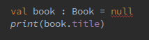
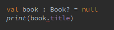
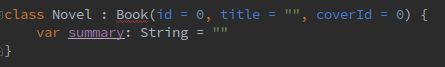
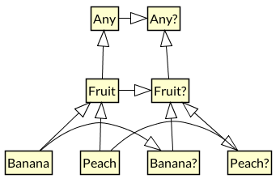

<!-- .slide: class="borderless big-th" style="text-align: left;" -->

### Kotlin: A language for productive developers <!-- .element: style="text-align: center;" -->

<br/>

Olmo Gallegos &nbsp;&nbsp;&nbsp;&nbsp;&nbsp;&nbsp;&nbsp;&nbsp; | Juan Ramón González González
:------------------------------------------------------------- | ----------------------------:
*App&Web*                                                      | *Quadbits*
[@voghDev](https://twitter.com/voghDev)                        | [@jrgonzalezg](https://twitter.com/jrgonzalezg)

---

## Introduction

- The Kotlin language
  - Basic features
  - Functional Programming (FP)
  - Extension functions
  - Kotlin on Android
- Advanced topics
  - Advanced Types
  - Domain Specific Languages (DSLs)
  - Coroutines
- To know more

Note: Consider talking about anko and other concrete details on Android Dev

---

## The Kotlin programming language

- Expressive
- Type-safe
<!-- .element: class="fragment" -->
- Functional (we’ll focus on that later)
<!-- .element: class="fragment" -->
- Created by JetBrains
<!-- .element: class="fragment" -->
- Official ! First class support in Android since Google I/O 2017
<!-- .element: class="fragment" -->
- Official support in Spring Framework 5.0 too (final version ~ July 2017))
<!-- .element: class="fragment" -->
- Made by and for Java “sufferers”
<!-- .element: class="fragment" -->

---

## Multiple targets

- Goal: Make it possible to use Kotlin for all parts of any project
- **Kotlin/JVM**
<!-- .element: class="fragment" data-fragment-index="1" -->
  - All features and the whole standard library, production-ready
<!-- .element: class="fragment" data-fragment-index="1" -->
  - 100% Interoperable with Java and Android
<!-- .element: class="fragment" data-fragment-index="1" -->
- **JavaScript**
<!-- .element: class="fragment" data-fragment-index="2" -->
  - All language features since Kotlin 1.1 and a large part of the standard library
<!-- .element: class="fragment" data-fragment-index="2" -->
  - JavaScript interoperability (including Node.js and browser support)
<!-- .element: class="fragment" data-fragment-index="2" -->
- **Kotlin / Native**
<!-- .element: class="fragment" data-fragment-index="3" -->
  - Machine code through LLVM
<!-- .element: class="fragment" data-fragment-index="3" -->
  - Mac OS X 10.10 and later (x86-64), x86-64 Ubuntu Linux (14.04, 16.04 and later), Apple iOS (arm64), Raspberry Pi, cross-compiled on Linux host, more to come...
<!-- .element: class="fragment" data-fragment-index="3" -->
  - Not yet feature complete
<!-- .element: class="fragment" data-fragment-index="3" -->

---

## Basic Features

- Data classes
- Null-safety
- Inheritance (open, closed classes)
- Interfaces with attrs, default methods
- Default values for attributes
- Smart casts
- with, apply, let functions
- Multiple inheritance
- Testability (JUnit4 100% supported)
- Coroutines! Since Kotlin 1.1 (to be described later)

---

<!-- .slide: style="text-align: left;" -->

## Data classes

- Java

```java
public class Book {
  int id;
  String title;
  int coverId;

  public int getId() {
    return id;
  }

  public void setId(int id) {
    this.id = id;
  }

  public String getTitle() {
    return title;
  }

  public void setTitle(String title) {
    this.title = title;
  }

  public int getCoverId() {
    return coverId;
  }

  public void setCoverId(int coverId) {
    this.coverId = coverId;
  }
}
```
<!-- .element: style="font-size: 30%" -->

- Kotlin
<!-- .element: class="fragment" data-fragment-index="1" -->

```kotlin
data class Book(val id: Int, val title: String, val coverId: Int)
```
<!-- .element: class="fragment" data-fragment-index="1" -->

---

## Null-Safety

Java (all non-primitive types are nullable in an unsafe way)

```java
Book book = null;
book.getTitle();
```

This code causes NPE!

---

## Null-Safety

Kotlin - Trying to use null in Non-Null types

```kotlin
val book: Book = null
print(book.title)
```

This code does not compile - "null can not be a value of a non-null type Book"



---

## Null-Safety - Nullable types

```kotlin
val book: Book? = null
print(book.title)
```

This code does not compile - "only safe (?.) or non-null asserted (!!) calls are allowed on a nullable receiver of type Book"



One way to make this work would be using the ? operator

---

## Null-Safety - Nullable types

```kotlin
val book: Book? = null
print(book?.title)
```

This code works, prints nothing. "title" is never evaluated because "book" is null. NPE is avoided

---

## Null-Safety - Nullable types

You can also assert non-null using the \!\! operator

```kotlin
val book: Book? = null
print(book!!.title)
```

This causes NPE, as we are forcing "book.title" to be evaluated, but "book" is null. Would behave similar to Java

---

## Inheritance

Given the previous data class "Book"

```kotlin
data class Book(val id: Int, val title: String, val coverId: Int)
```

We want to create a subclass called "Novel"
<!-- .element: class="fragment" data-fragment-index="1" -->

```kotlin
class Novel(id: Int = 0, title: String = "", coverId: Int = 0,
        var summary: String = "") : Book(id, title, coverId)
```
<!-- .element: class="fragment" data-fragment-index="2" -->

We find that we can't. Compiler yields "this type is final, so we can't inherit from it"
<!-- .element: class="fragment" data-fragment-index="3" -->


<!-- .element: class="fragment" data-fragment-index="3" -->

Book needs to be declared as open class for inheritance to work
<!-- .element: class="fragment" data-fragment-index="4" -->

```kotlin
open class Book(val id: Int, val title: String, val coverId: Int)
```
<!-- .element: class="fragment" data-fragment-index="4" -->

---

## Interfaces with attributes and default methods

In Kotlin, interfaces can have attributes

Java
<!-- .element: class="fragment" data-fragment-index="1" -->

```java
public interface Request<T> {
  T client; // Does not compile

  void execute();
}
```
<!-- .element: class="fragment" data-fragment-index="1" -->

Kotlin
<!-- .element: class="fragment" data-fragment-index="2" -->

```kotlin
interface Request<T> {
  val client : T

  fun execute()
}
```
<!-- .element: class="fragment" data-fragment-index="2" -->

---

## Interfaces with attributes and default methods

Java: Default template methods are supported in abstract classes

```java
public abstract class Request<T> {
  T client; // Compiles

  void execute() {
    // Default implementation for method
  }
}
```
<!-- .element: class="fragment" data-fragment-index="1" -->

Kotlin
<!-- .element: class="fragment" data-fragment-index="2" -->

```kotlin
interface Request<T> {
  val client : T

  fun execute() {
    // Default implementation
  }
}
```
<!-- .element: class="fragment" data-fragment-index="2" -->

---

## Default values for attributes

Java: Telescoping constructor problem - Builder pattern

Kotlin: Attributes with default values to the rescue!
<!-- .element: class="fragment" data-fragment-index="1" -->

```kotlin
data class Book(val id: Int = 0, val title: String = "", val coverId: Int = 0)

fun initBooks() {
  val books = listOf(
    Book(id = 1),
    Book(id = 2, title = "Moby dick"),
    Book(id = 3, title = "Sherlock Holmes", coverId = 254),
    Book()
  )

  books.forEach {
    print(it.title)
  }
}
```
<!-- .element: class="fragment" data-fragment-index="1" -->

---

## Smart casts

Null safety

```kotlin
val book : Book?

book.title // Does not compile

book?.title // Ok

if (book != null) {
  book.title // Ok
}
```

Smart type casts
<!-- .element: class="fragment" data-fragment-index="1" -->

```kotlin
open class Book(val id: Int = 0, val title: String = "", val coverId: Int = 0)

class Novel(id: Int = 0, title: String = "", coverId: Int = 0,
        var summary: String = "") : Book(id, title, coverId)

```
<!-- .element: class="fragment" data-fragment-index="1" -->

```kotlin
val novel: Book = Novel()

(novel as Novel).summary = "Once upon a time..."

if (novel is Novel) {
  novel.summary = "Once upon a time..."
}
```
<!-- .element: class="fragment" data-fragment-index="2" -->

---

## Elvis operator

Java

```Java
String title;

System.out.println(title != null ? title : "-");
```

```Java
List<Novel> novels;

System.out.println(
    novels != null && novels.size() > 0 ? String.format("%d novels", novels.size()) : "No novels"
);
```
<!-- .element: class="fragment" data-fragment-index="2" -->

Kotlin
<!-- .element: class="fragment" data-fragment-index="1" -->

```kotlin
val title: String?

print(title ?: "-")
```
<!-- .element: class="fragment" data-fragment-index="1" -->

```kotlin
val novels : List<Novel>?

print("${novels?.size ?: "No"} novels")
```
<!-- .element: class="fragment" data-fragment-index="4" -->

---

## Functional Programming (FP)

%%%

### Some Principles

- A computation can be viewed as a **function** that maps inputs to outputs

- **Pure functions**
  - <div>Always return the **same result** for the **same arguments**</div>
<!-- .element: class="fragment" data-fragment-index="1" -->
  - <div>The evaluation of the result has **no observable side effects**</div>
<!-- .element: class="fragment" data-fragment-index="2" -->
  - <div>A functions that takes no parameters must return a constant value</div>
<!-- .element: class="fragment" data-fragment-index="3" -->
  - <div>Function **signature does not lie**</div>
<!-- .element: class="fragment" data-fragment-index="4" -->
    - You can infer what the function may do by its signature
<!-- .element: class="fragment" data-fragment-index="4" -->
    - If the function has no parameters it should return a constant
<!-- .element: class="fragment" data-fragment-index="4" -->

%%%

<!-- .slide: style="text-align: left;" -->

### Some Principles <!-- .element: style="text-align: center;" -->

- **Immutability** by default
  - <div>Immutable data **can not be changed** after it is created</div>
<!-- .element: class="fragment" data-fragment-index="1" -->
  - <div>**State changes** are represented by new instances of data</div>
<!-- .element: class="fragment" data-fragment-index="2" -->
  - <div>**Original instances** are not affected</div>
<!-- .element: class="fragment" data-fragment-index="3" -->
  - <div>Simplifies multi-threaded applications (**race conditions**)</div>
<!-- .element: class="fragment" data-fragment-index="4" -->

```kotlin
data class Book(val id: Int, val title: String, val coverId: Int)

val book = Book(id = 3, title = "Sherlock Holmes", coverId = 254) // Immutable
val modifiedBook = book.copy(coverId = 2) // Copy is a separate immutable instance
```
<!-- .element: class="fragment" data-fragment-index="5" -->

- <div>The value of `book` can not be changed</div>
<!-- .element: class="fragment" data-fragment-index="6" -->
- <div>Creation of `modifiedBook` does not affect the value of book</div>
<!-- .element: class="fragment" data-fragment-index="7" -->
- <div>`modifiedBook` is also immutable</div>
<!-- .element: class="fragment" data-fragment-index="8" -->

%%%

### First-class Functions

- Functions as a **first-class citizen** of the language

- <div>**Higher-order functions**</div> <!-- .element: class="fragment" data-fragment-index="1" -->
  - <div>Functions can **return functions**</div>
<!-- .element: class="fragment" data-fragment-index="2" -->
  - <div>Functions can be **passed as arguments** to other functions</div>
<!-- .element: class="fragment" data-fragment-index="3" -->
  - <div>Functions can be **assigned to variables** and stored inside other data structures</div>
<!-- .element: class="fragment" data-fragment-index="4" -->

- <div>Lambda Expressions</div> <!-- .element: class="fragment" data-fragment-index="5" -->
  - <div>Functions that are **not declared** but **passed immediately** as **an expression**</div>
<!-- .element: class="fragment" data-fragment-index="5" -->

%%%

### Lambda Expressions

- Always **surrounded by curly braces**
- map on List is a higher-order function
- You can pass a lambda expression as the transform function

```kotlin
fun <T, R> List<T>.map(transform: (T) -> R): List<R> {
    val result = arrayListOf<R>()
    for (item in this)
        result.add(transform(item))
    return result
}

val ints = listOf(1, 2, 3)

val doubled = ints.map { value -> value * 2 } // [2, 4, 6]

println(ints.map { it * 3 } ) // [3, 6, 9] - Implicit name for single parameter
```

%%%

<!-- .slide: style="text-align: left;" -->

### Collections <!-- .element: style="text-align: center;" -->

- Kotlin distinguishes **mutable** and **immutable** collections
  - <div>You have control over when collections can be edited</div>
<!-- .element: class="fragment" data-fragment-index="1" -->
  - <div>Helps to eliminate bugs and to design better APIs</div>
<!-- .element: class="fragment" data-fragment-index="2" -->

```kotlin
val ids: List<Int> = listOf(1, 2, 3)
println(ids.get(2)) // 3
ids.add(0, 6) // Unresolved reference: add

val numbers: MutableList<Int> = mutableListOf(5, 9, 3)
numbers.add(0, 6)
println(numbers) // [6, 5, 9, 3]
```
<!-- .element: class="fragment" data-fragment-index="2" -->

- <div>Currently the *immutable* collections are really **read-only versions of mutable collections**</div>
<!-- .element: class="fragment" data-fragment-index="3" -->
- <div>[https://github.com/Kotlin/kotlinx.collections.immutable](https://github.com/Kotlin/kotlinx.collections.immutable)</div>
<!-- .element: class="fragment" data-fragment-index="4" -->
  - <div>Prototypes of real immutable collections with the performance characteristics of typical **FP persistent data structures**</div>
<!-- .element: class="fragment" data-fragment-index="4" -->

%%%

### Functional Combinators

- John Hughes: *A combinator is a function which builds programs fragments from program fragments*
<!-- .element: class="fragment" data-fragment-index="1" -->

- Functional Programming languages usually provide a big set of **combinators for collections**
<!-- .element: class="fragment" data-fragment-index="2" -->

```kotlin
val strings = listOf("Kotlin", "is", "here", "to", "stay")

val result = strings.filter { it.length == 4 }
        .map(String::toUpperCase) // Method reference
        .sortedByDescending { it } // Natural sort order
        .joinToString(separator = " ")

println(result) // STAY HERE
```
<!-- .element: class="fragment" data-fragment-index="3" -->

%%%

### Functional Combinators

```kotlin
val strings = listOf("Kotlin", "is", "here", "to", "stay")

val result: Map<Char, Int> = strings
        .filterNot { it.contains('t') } // Keep only strings without 't'
        .flatMap { it.toList() } // A list of chars from the list of strings
        .groupBy { it } // A map from each char to its occurrences
        .mapValues { it.value.size } // A map from char to occurrence count
        .toList() // List of pairs (char, count)
        .sortedBy { it.second } // Sorted by increasing count

println(result)
// [(i, 1), (s, 1), (h, 1), (r, 1), (e, 2)]

```

---

## with, let, apply

Java

```java
final TextView textView = new TextView(this);
textView.setText("Hello!");
textView.setTextSize(16f);
textView.setTextColor(ContextCompat.getColor(this, android.R.color.white));
```

Kotlin

```kotlin
val textView : TextView = TextView(this)
with(textView) {
    text = ""
    textSize = 16f
    setTextColor(color(android.R.color.white))
}
```

Optional receiver can't be used in this case

---

## with, let, apply

Java

```java
LinearLayout linearLayout = new LinearLayout(this);
if (textView != null) {
    linearLayout.addView(textView);
    setContentView(linearLayout);
}
```

Kotlin

```kotlin
val linearLayout = LinearLayout(this)
textView?.let {
    linearLayout.addView(it)
    setContentView(linearLayout)
}
```

let won't be applied if textView is null

---

## with, let, apply

Java

```java
TextView textView = new TextView(this);
textView.setText("Hello!");
textView.setTextSize(16f);
textView.setTextColor(ContextCompat.getColor(this, android.R.color.white));
```

Kotlin

```kotlin
val textView: TextView = TextView(this).apply {
    text = "Hello!"
    textSize = 16f
    setTextColor(color(android.R.color.white))
}
```

textView can also be optional and this code will still work

---

## Multiple inheritance

```kotlin
interface Transportation {
    fun move()
    fun emitCO2()
}
```

```kotlin
interface PieceOfMuseum {
    fun shine()
    fun lookGreat()
}

```

A car can be a mean of Transportation, and also a Piece of museum
<!-- .element: class="fragment" data-fragment-index="1" -->

```kotlin
class Car : Transportation, PieceOfMuseum {
    override fun move() {
    }

    override fun shine() {
    }

    override fun emitCO2() {
    }

    override fun lookGreat() {
    }
}
```
<!-- .element: class="fragment" data-fragment-index="2" -->

---

## Multiple inheritance by delegation

Car class is built with two parameters, one is responsible for the "Transportation" behavior, and the other one for the "PieceOfMuseum"

```kotlin
class LuxuryRacingCar(t: Transportation, p: PieceOfMuseum) :
        Transportation by t, PieceOfMuseum by p {
    fun letTheShowBegin() {
        move()
        shine()
        emitCO2()
        lookGreat()
    }
}
```

---

## Testability

- JUnit is 100% supported
- Test names are very readable, near specification of real requirements

```kotlin
@Test
fun 'should request a List of users on start'() {
    val presenter = UserListPresenter(mockContext, userRepository)

    presenter.view = mockView
    presenter.initialize()

    verify(userRepository, times(1))?.getUsers()
}
```

---

## Testability: Mockito support

- Similarly to Java, Mockito is supported
- A Small issue related to final classes (easy to solve)
- [mockito-kotlin](https://github.com/nhaarman/mockito-kotlin) adds some syntactic sugar

```kotlin
@Test
fun 'should show a list of users if previous request has results'() {
    val presenter = UserListPresenter(mockContext, userRepository)
    `when`(userRepository.getUsers()).thenReturn(listOf(User(name = "John")))

    presenter.view = mockView
    presenter.initialize()

    verify(mockView, times(1))?.showUsers(anyList())
}
```

```kotlin
@Mock lateinit var userRepository: UserRepository

@Mock lateinit var mockContext: Context

@Mock lateinit var mockView: SomeDetailPresenter.MVPView

@Before
fun setUp() {
    MockitoAnnotations.initMocks(this)
}
```
<!-- .element: class="fragment" data-fragment-index="1" -->

Test names can be made even more readable using third-party components like
<!-- .element: class="fragment" data-fragment-index="2" -->
[kotlintest](https://github.com/kotlintest/kotlintest)

---

## Advanced Types

Note: [Juanra speaks] This slide is just to let the crowd know that we are switching to a new section

%%%

### Type Hierarchy

- Any
  - **Any?** is the **root** of the hierarchy (a **supertype** of any other type)
  - **Any** is a **subtype of Any?** and the **root of the Non-Null types**

- Unit
  - A type with **only one value**: the Unit object
  - Corresponds to the **void type in Java**

%%%

### Type Hierarchy

- Nothing
  - Nothing has **no instances**
  - Represents a value that **never exists**
  - Example: Functions that **never return** (always throw an exception)
  - Bottom type: It is a **subtype of any other type**

```kotlin
public inline fun TODO(reason: String): Nothing =
  throw NotImplementedError("An operation is not implemented: $reason")

fun doSomething: A = TODO("This should do something!") // Valid implementation
```

%%%

### Type Hierarchy

- Mistaeks I Hav Made: A Whirlwind Tour of the Kotlin Type Hierarchy
  - Good general explanation of Kotlin Types
  - **Relation between Nullable and Non-Null Types**

  
  - [http://natpryce.com/articles/000818.html](http://natpryce.com/articles/000818.html)

%%%

### Variance

- Definition: **`A <: B`** if `A` is a **subtype of** `B`

- What if we have generics (*type constructors*) like `List`?

  - **Covariant**: `interface List<out A>`
    - If **`A <: B`** then **`List<A> <: List<B>`**

  - **Contravariant**: `interface List<in A>`
    - If **`A <: B`** then **`List<A> >: List<B>`**

  - **Invariant**: `interface List<A>`
    - **Neither** `List<A>` nor `List<B>` are **a subtype of the other**

%%%

### Variance

```kotlin
interface List<out A> {
  fun get(index: Int): A // Safe
  fun add(a: A): Boolean // Unsafe
}
```

```kotlin
var cats: List<Cat> = listOf(cat1, cat2, cat3)
var animals: List<Animal> = cats

val animal = animals.get(0) // Ok!
animals.add(dog1) // Problem - Adding a dog to a list of cats!
```

- List in Kotlin is covariant - Why?
  - It is read-only so A never appears in a contravariant position
  <!-- .element: class="fragment" data-fragment-index="1" -->
  - MutableList is invariant
  <!-- .element: class="fragment" data-fragment-index="2" -->
  - You can control variance and the compiler enforces it
  <!-- .element: class="fragment" data-fragment-index="3" -->
  - Use @UnsafeVariance annotation if you know something is safe despite it appears in an unsafe position
  <!-- .element: class="fragment" data-fragment-index="3" -->

%%%

### Variance

```kotlin
// File: kotlin.jvm.functions.Functions.kt

/** A function that takes 1 argument. */
public interface Function1<in P1, out R> : Function<R> {
    /** Invokes the function with the specified argument. */
    public operator fun invoke(p1: P1): R
}

// Int <: Number, Novel <: Book, so Function1<Number, Novel> <: Function1<Int, Book>
val queryNovelFunc: Function1<Number, Novel> = { Novel() }
val queryBookFunc: Function1<Int, Book> = queryNovelFunc
val book: Book = queryBookFunc(1)
val book2: Book = queryNovelFunc(7.0)
```

%%%

<!-- .slide: style="text-align: left;" -->

### Algebraic Data Types (ADTs) - Product Types <!-- .element: style="text-align: center;" -->

- Seen in the wild as: Tuples, Records, POJOs…
- Directly supported in most languages
<!-- .element: class="fragment" data-fragment-index="1" -->
- Kotlin: Ideally as a data class
<!-- .element: class="fragment" data-fragment-index="2" -->

```kotlin
data class Book(val id: Int, val title: String, val coverId: Int)
```
<!-- .element: class="fragment" data-fragment-index="2" -->

- Always contains an id, a title and a coverId
<!-- .element: class="fragment" data-fragment-index="3" -->
- There are as many possible inhabitants of the type as the product of the number of values in each of the composing subtypes
<!-- .element: class="fragment" data-fragment-index="4" -->

%%%

<!-- .slide: style="text-align: left;" -->

### Algebraic Data Types (ADTs) - Sum Types <!-- .element: style="text-align: center;" -->

- Also named: Coproducts, Tagged Types, Disjoint Unions or Variant Types
- No direct support on many languages
<!-- .element: class="fragment" data-fragment-index="1" -->
- Kotlin: Use sealed classes
<!-- .element: class="fragment" data-fragment-index="2" -->

```kotlin
sealed class BookResult {
    class  BookFound(val book: Book) : BookResult()
    object BookNotFound : BookResult()
    object BookUnavailable : BookResult()
}
```
<!-- .element: class="fragment" data-fragment-index="2" -->

- It can contain only one of the enclosed types and nothing else
<!-- .element: class="fragment" data-fragment-index="3" -->
- As many possible inhabitants as the sum of inhabitants on each subtype
<!-- .element: class="fragment" data-fragment-index="4" -->

%%%

<!-- .slide: style="text-align: left;" -->

### Algebraic Data Types (ADTs) - Example <!-- .element: style="text-align: center;" -->

- Based on [https://fsharpforfunandprofit.com/ddd/](https://fsharpforfunandprofit.com/ddd/)

```kotlin
typealias ContactName = String
data class Contact(val name: ContactName, val primaryContactInfo: ContactInfo,
        val secondaryContactInfo: ContactInfo? = null)

sealed class ContactInfo {
    class EmailContactInfo(val email: String): ContactInfo()
    class PostalContactInfo(val address: String): ContactInfo()
}

fun sendMessageUsingPrimaryContactInfo(contact: Contact): Unit =
  when (contact.primaryContactInfo) {
    is ContactInfo.EmailContactInfo -> sendEmail(contact.primaryContactInfo)
    is ContactInfo.PostalContactInfo -> TODO() // NotImplementedError
  }

abstract fun sendEmail(emailContactInfo: EmailContactInfo) // Somewhere
```

- **Ideal for domain-driven design (DDD)**
<!-- .element: class="fragment" data-fragment-index="1" -->
- A Contact requires a name and at least a primaryContactInfo
<!-- .element: class="fragment" data-fragment-index="2" -->
- It is not possible to create a contact with no primary contact info (or null)
<!-- .element: class="fragment" data-fragment-index="3" -->
- when branches are autocompleted, include smarcasts and the compiler ensures you handle all ContactInfo options => Less tests
<!-- .element: class="fragment" data-fragment-index="4" -->
- TODO() => Runtime Exception, add to static code analysis (detekt in Kotlin, checkstyle, findbugs)
<!-- .element: class="fragment" data-fragment-index="5" -->

%%%

### Higher-Kinded Types (HKTs)

- Generics only allow to abstract over the enclosed type
<!-- .element: class="fragment" -->

- What if we also want to **abstract over the type constructor** itself?
<!-- .element: class="fragment" -->

- It is allowed on languages like Haskell or **Scala (F[\_])**
<!-- .element: class="fragment" -->

- Kotlin does not support this directly
<!-- .element: class="fragment" -->

- **kategory\!**
<!-- .element: class="fragment" -->

%%%

### **kategory**: Functional Data Types and abstractions for Kotlin
  - Based on Cats: [http://typelevel.org/cats/](http://typelevel.org/cats/)
  - <div>**Custom encoding** to allow defining **HKTs** and **type classes**</div>
<!-- .element: class="fragment" data-fragment-index="1" -->
    - <div>Inspired by highj: [https://github.com/highj/highj](https://github.com/highj/highj)</div>
<!-- .element: class="fragment" data-fragment-index="1" -->
  - <div>With **Free monads!**</div>
<!-- .element: class="fragment" data-fragment-index="2" -->
    - <div>Totally separate **program definition** from **program interpretation**</div>
<!-- .element: class="fragment" data-fragment-index="2" -->
  - <div>[https://github.com/kategory/kategory](https://github.com/kategory/kategory)</div>
<!-- .element: class="fragment" data-fragment-index="3" -->

---

## Domain Specific Languages (DSLs)

- Gradle Kotlin DSL: Kotlin language support for **Gradle build scripts**
  - [https://github.com/gradle/kotlin-dsl](https://github.com/gradle/kotlin-dsl)
  - Covers yet another part of a whole project

- Life is Great and Everything Will Be Ok, Kotlin is Here (Google I/O '17 - [https://www.youtube.com/watch?v=fPzxfeDJDzY](https://www.youtube.com/watch?v=fPzxfeDJDzY))
<!-- .element: class="fragment" data-fragment-index="1" -->

```kotlin
val db: SQLiteDatabase = // ...
db.transaction {
    delete("users", "first_name = ?", arrayOf("jake"))
    // ….
}

inline fun SQLiteDatabase.transaction(body: SQLiteDatabase.() -> Unit) {
    beginTransaction()
    try {
        body()
        setTransactionSuccessful()
    } finally {
        endTransaction()
    }
}
```
<!-- .element: class="fragment" data-fragment-index="1" -->

---

## Coroutines

- **Computations that can be suspended** without blocking a thread
- <div>Very **lightweight**: Millions of coroutines can run on a few threads</div>
<!-- .element: class="fragment" -->
- <div>A suspended coroutine **does not consume a thread**</div>
<!-- .element: class="fragment" -->
- <div>Allow to **express** an asynchronous computation **on a sequential way**</div>
<!-- .element: class="fragment" -->
- <div>**No** need to use **callbacks**</div>
<!-- .element: class="fragment" -->
- <div>**Experimental feature** on Kotlin 1.1 (API may still change)</div>
<!-- .element: class="fragment" -->
- <div>Implemented through compiler transformations, **no OS / VM support needed**</div>
<!-- .element: class="fragment" -->
- <div>Language support: Suspending functions (**suspend keyword**)</div>
<!-- .element: class="fragment" -->
- <div>Low level core API in the Kotlin Standard Library</div>
<!-- .element: class="fragment" -->
- <div>High level APIs that can be used directly in the user code</div>
<!-- .element: class="fragment" -->

---

## Coroutines

[https://github.com/Kotlin/kotlinx.coroutines/blob/master/coroutines-guide.md](https://github.com/Kotlin/kotlinx.coroutines/blob/master/coroutines-guide.md)

```kotlin
suspend fun doSomethingUsefulOne(): Int {
    delay(1000L) // pretend we are doing something useful here
    return 13
}

suspend fun doSomethingUsefulTwo(): Int {
    delay(1000L) // pretend we are doing something useful here, too
    return 29
}
```

---

<!-- .slide: style="text-align: left;" -->

## Coroutines <!-- .element: style="text-align: center;" -->

```kotlin
fun main(args: Array<String>) = runBlocking<Unit> {
    val time = measureTimeMillis {
        val one = async(CommonPool) { doSomethingUsefulOne() }
        val two = async(CommonPool) { doSomethingUsefulTwo() }
        println("The answer is ${one.await() + two.await()}")
    }
    println("Completed in $time ms")
}
```

It produces something like this:

The answer is 42

Completed in 1017 ms

---

## To know more

- References
  - Documentation - Kotlin Programming Language
<!-- .element: class="fragment" data-fragment-index="1" -->
    - [https://kotlinlang.org/docs/](https://kotlinlang.org/docs/)
<!-- .element: class="fragment" data-fragment-index="1" -->
  - Kotlin and Android | Android Developers
<!-- .element: class="fragment" data-fragment-index="2" -->
    - [https://developer.android.com/kotlin/index.html](https://developer.android.com/kotlin/index.html)
<!-- .element: class="fragment" data-fragment-index="2" -->
  - Books
<!-- .element: class="fragment" data-fragment-index="3" -->
    - Kotlin for Android Developers - Antonio Leiva
<!-- .element: class="fragment" data-fragment-index="3" -->
      - [https://leanpub.com/kotlin-for-android-developers/](https://leanpub.com/kotlin-for-android-developers/)
<!-- .element: class="fragment" data-fragment-index="3" -->
    - Kotlin in Action - Dmitry Jemerov and Svetlana Isakova
<!-- .element: class="fragment" data-fragment-index="3" -->
      - [https://www.manning.com/books/kotlin-in-action](https://www.manning.com/books/kotlin-in-action)
<!-- .element: class="fragment" data-fragment-index="3" -->
- <div>Lambda World - October 26th & 27th, 2017: [http://www.lambda.world/](http://www.lambda.world/)</div>
<!-- .element: class="fragment" data-fragment-index="4" -->
  - Hadi Hariri - VP of Developer Advocacy, JetBrains - Kotlin talk
<!-- .element: class="fragment" data-fragment-index="4" -->

---

## To know more

- HelloKotlin
  - Some learning and feature testing with the Kotlin language
  - Model View Presenter (MVP)
  - Repository Pattern
  - Many tests (reword this)
  - Single God Package, Thermosiphon Samples
  - [https://github.com/voghDev/HelloKotlin](https://github.com/voghDev/HelloKotlin)
- OpenLibraryApp (Incomplete WIP)
<!-- .element: class="fragment" data-fragment-index="1" -->
  - Sample Android App to query and display Open Library data
<!-- .element: class="fragment" data-fragment-index="1" -->
  - Dependency Injection (DI) with Dagger 2
<!-- .element: class="fragment" data-fragment-index="1" -->
  - Clean Architecture, Repository Pattern, MVP
<!-- .element: class="fragment" data-fragment-index="1" -->
  - Domain-driven design, Package by feature
<!-- .element: class="fragment" data-fragment-index="1" -->
  - Functional Programming (FP), Coroutines
<!-- .element: class="fragment" data-fragment-index="1" -->
  - [https://github.com/jrgonzalezg/OpenLibraryApp](https://github.com/jrgonzalezg/OpenLibraryApp)
<!-- .element: class="fragment" data-fragment-index="1" -->

---

<!-- .slide: class="borderless big-th" style="text-align: left;" -->

### Thanks! <!-- .element: style="text-align: center;" -->

<br/>

Olmo Gallegos &nbsp;&nbsp;&nbsp;&nbsp;&nbsp;&nbsp;&nbsp;&nbsp; | Juan Ramón González González
:------------------------------------------------------------- | ----------------------------:
*App&Web*                                                      | *Quadbits*
[@voghDev](https://twitter.com/voghDev)                        | [@jrgonzalezg](https://twitter.com/jrgonzalezg)

<br/>

<div>[https://github.com/jrgonzalezg/kotlin-overview-talk](https://github.com/jrgonzalezg/kotlin-overview-talk)</div>
<!-- .element: style="text-align: center;" -->
